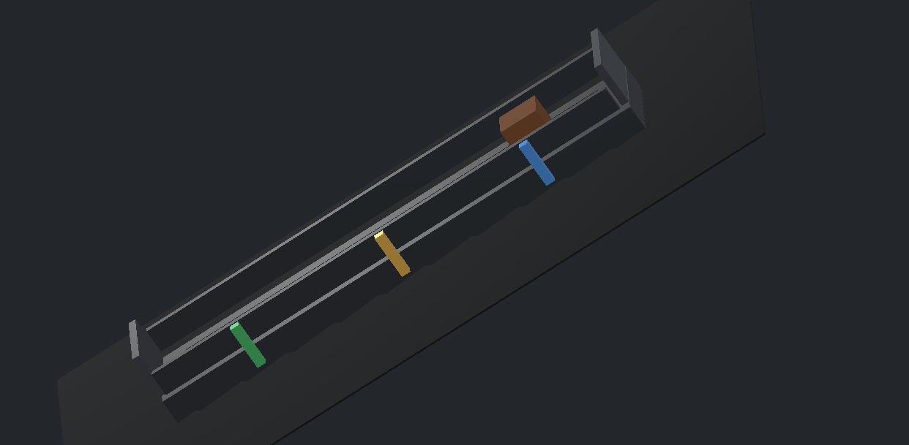
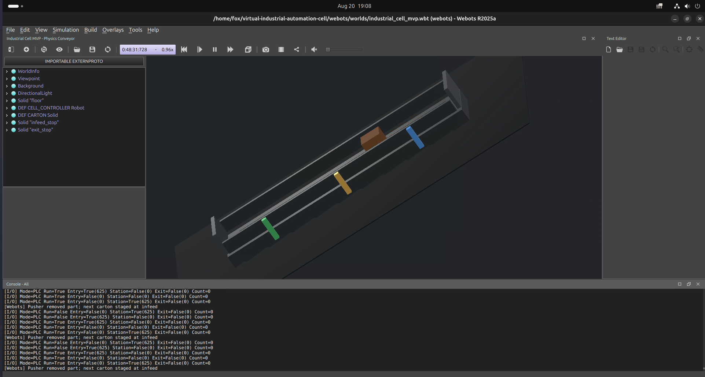
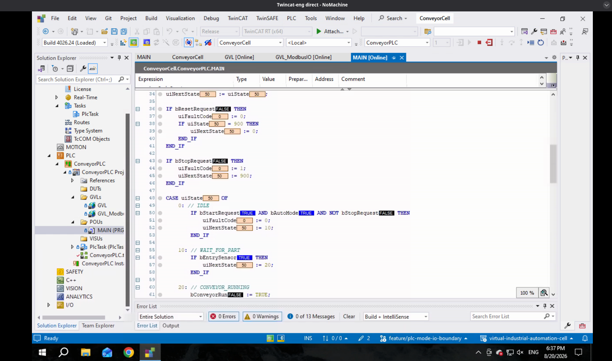
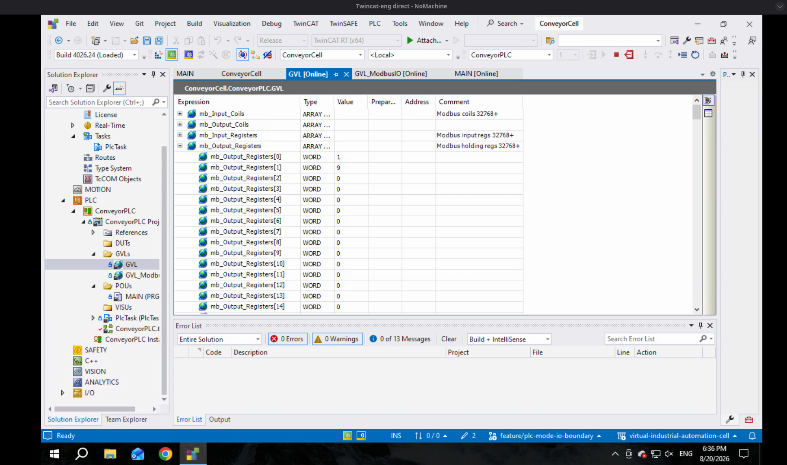

# Virtual Industrial Automation Cell

A conveyor cell simulated in physics, driven by real PLC code, monitored over industrial protocols — built end to end across a segmented OT network.

> **This is a personal engineering lab, not production equipment.** It exists to build and demonstrate a complete industrial control stack on hardware I own.



## What this is

A Beckhoff TwinCAT PLC runs the machine logic. A Webots simulation provides the machine *body* — a physics-driven conveyor, a carton with real mass and friction, and three photo-eye sensors. The two talk over Modbus TCP, so the PLC is genuinely controlling a simulated machine rather than running a demo of itself.

Above that sit the layers a real cell would have: an OPC UA gateway, an Ignition Perspective SCADA dashboard, and a PostgreSQL historian — each on its own VM, on a network segmented the way an OT environment is.

The point was to understand the whole path: how an operator's intent becomes a bit on a wire, becomes motion, and comes back as telemetry.

## Control architecture

The responsibility split is deliberate, and it's the part of this project I'd defend hardest in an interview:

| Layer | Role | Does NOT |
|---|---|---|
| **Webots** | machine body — physics, sensors, actuators | make production decisions |
| **TwinCAT** | machine brain — sequencing, interlocks, counting, faults | know about the network above it |
| **Ignition** | operator intent — start/stop/reset requests | command physics directly |
| **Gateway** | translator — protocol bridging, tag normalisation | become a second PLC |
| **Historian** | memory — records | control anything |

The Webots supervisor enforces this with an explicit mode boundary (`WEBOTS_CELL_MODE`):

- **`demo`** — self-running: the simulation drives itself and counts locally. Tagged `webots-physics-demo-v0.1`.
- **`plc`** — the simulation stops deciding anything. It reports sensors and waits for external I/O.

Splitting these stopped the simulation from quietly absorbing logic that belongs in the PLC — the most common way a project like this becomes a toy.



*`plc` mode running. The console reports `Mode=PLC`, the live photo-eye states, and `Count=0` — the simulation has stopped counting parts, because counting belongs to the PLC now.*

## PLC state machine

Eight states in structured text (`plc/ConveyorCell/ConveyorPLC/POUs/MAIN.TcPOU`):

```
  0  IDLE                40  PUSHER_EXTENDING
 10  WAIT_FOR_PART       50  PUSHER_RETRACTING
 20  CONVEYOR_RUNNING    60  COMPLETE
 30  PART_AT_STATION    900  FAULT
```

State timeouts and action timers guard each transition, so a movement that never completes raises a fault (codes 1, 2, 99) rather than hanging the cell. `EStopHealthy` is reserved in the I/O map but not yet consumed by the logic — see Status.



*The state machine online in XAE, values updating live against the running PLC: `uiState` 50 (`PUSHER_RETRACTING`), with `bStartRequest` and `bAutoMode` both true.*

## Modbus I/O boundary

All PLC↔simulation traffic crosses one documented word-mapped boundary (`GVLs/GVL_ModbusIO.TcGVL`):

| Word | Direction | Contents |
|---|---|---|
| `mwSensors` | Webots → PLC | EntrySensor, StationSensor, ExitSensor, EStopHealthy |
| `mwCommands` | HMI → PLC | StartRequest, StopRequest, ResetRequest, AutoMode |
| `mwActuators` | PLC → Webots | ConveyorRun, PusherExtend |
| `mwStatus` | PLC → up | Running, FaultActive, CycleActive |
| `mwStateCode` | PLC → up | current state code |
| `mwFaultCode` | PLC → up | active fault code |
| `mwPartCount` | PLC → up | completed parts |

Keeping the boundary to a handful of words — rather than scattering tags — meant the interface could be reasoned about, documented, and tested as a unit.



*The command word live in the PLC. Holding register 32769 reads 9 — `StartRequest` and `AutoMode` set together. Writing that one value is how the cell is told to run.*

## Stack

| Layer | Technology |
|---|---|
| Virtualisation | Proxmox VE |
| PLC / Control | Beckhoff TwinCAT (IEC 61131-3 structured text) |
| Simulation | Webots R2025a |
| Field protocol | Modbus TCP |
| Protocol gateway | Python, `asyncua` (OPC UA) |
| SCADA | Ignition Perspective |
| Historian | PostgreSQL |

## VM layout

Five VMs on Proxmox, on a segmented lab network:

| VM | Address | Purpose |
|---|---:|---|
| `twincat-eng` | `192.168.1.181` | TwinCAT engineering + runtime (Windows) |
| `webots-sim` | `192.168.1.182` | Webots simulation |
| `automation-ignition-scada` | `192.168.1.183` | Ignition SCADA |
| `postgres-historian` | `192.168.1.184` | PostgreSQL historian |
| `gateway` | `192.168.1.187` | OPC UA gateway / protocol bridge |

## Status

**The closed loop is live.** TwinCAT drives the Webots cell over Modbus TCP, cycling a part roughly every 5.5 seconds.

- [x] Proxmox VM stack, segmented network, static reservations
- [x] Webots physics conveyor with photo-eye sensors and carton dynamics
- [x] PostgreSQL historian installed, `industrial_cell` schema created
- [x] Ignition installed, connected over OPC UA, Perspective dashboard live
- [x] Gateway OPC UA server publishing simulation state
- [x] TwinCAT structured-text state machine with fault codes and state timeouts
- [x] Modbus TCP I/O boundary — PLC drives the simulated cell end to end
- [ ] E-stop interlock — mapped in the I/O boundary, not yet consumed by the logic
- [ ] Ignition operator commands routed through to the PLC
- [ ] Historian logging connected to the live tag stream

## Known limitations and open design questions

Recorded honestly rather than quietly fixed — these are the things I'd want to talk through, not hide.

**The timeout is measured in the wrong clock.** State 20 (`CONVEYOR_RUNNING`) guards itself with `tStateTimeout`, preset to `T#10S`. The part travels 1.05 m from the entry photo-eye to the station eye at a belt speed of 0.24 m/s — about **4.4 s** ideal, so roughly 2.3x margin.

That margin is thinner than it looks. The carton isn't teleported; it's dragged by friction against the `Track`, so it slips and takes longer than the ideal figure. More importantly, **the PLC counts wall-clock seconds while Webots runs at 0.94–0.99x real time**, and drops further under rendering load. Put enough load on the simulation host and a cycle that is perfectly healthy in *simulated* time overruns a timeout measured in *real* time — the controller faults a plant that never actually failed.

On real hardware this coupling doesn't exist: the plant and the PLC share one clock. Against a simulator they don't, which raises a question I haven't settled — should a timeout guarding a simulated plant be driven by the simulation's own clock rather than the PLC's? Doing so would make the test honest, but would also mean the PLC code differs between simulation and deployment, which defeats part of the point.

**`EStopHealthy` is mapped but not implemented.** It occupies `mwSensors.3` in the I/O boundary and is never read by the logic. The cell has fault handling and state timeouts; it does not have an E-stop interlock.

**Operator Stop is recorded as a fault.** `bStopRequest` drives `uiState := 900` with `uiFaultCode := 1`. It works, and "stop aborts the cycle" is a defensible pattern, but recording a routine operator action with a fault code conflates two different things.

## Repository layout

```
plc/ConveyorCell/     TwinCAT XAE solution — PLC source in ConveyorPLC/POUs/MAIN.TcPOU
webots/               simulation world and supervisor controller
src/gateway/          OPC UA server / protocol bridge
src/database/         historian schema
docs/                 architecture, control-architecture, network layout, build log
```

`docs/control-architecture.md` is the authoritative design document.

## License

MIT — see [LICENSE](LICENSE).
